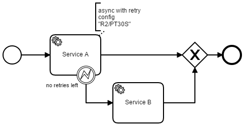
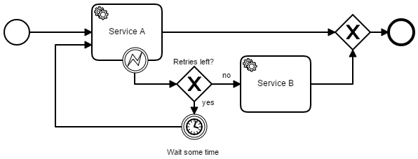
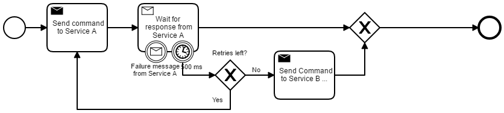
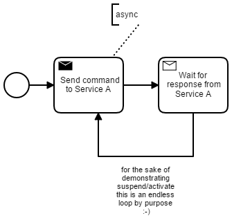
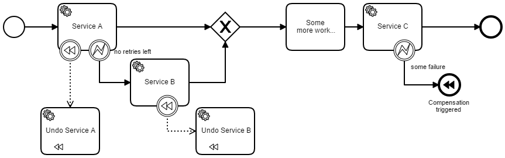

# BPMN Resilience Patterns

This project shows some possibilities to model and execute resilient workflows using BPMN on Camunda.

## Synchronous call, retry using Camunda, fallback when retries are used up

## Synchronous call, modeled retry and fallback

## Asynchronous collaboration, modeled retry and fallback

## Suspending message send (e.g. downtime of system)

## Compensation

## How to use and understand

Goto the Test case [ResiliencePatternsTest.java](src/test/java/com/camunda/demo/resilience/ResiliencePatternsTest.java) and inspect the different test scenarios. You can run it directly from your IDE.

Built and tested against Camunda BPM version 7.7.0.

## License
[Apache License, Version 2.0](http://www.apache.org/licenses/LICENSE-2.0).
